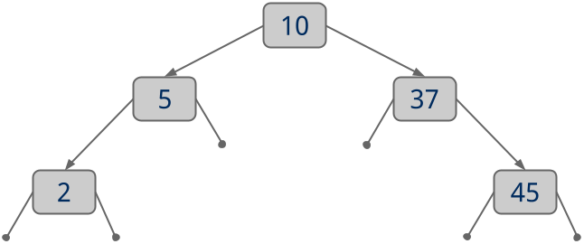

# Binary-Search-Tree
To gain a better understanding of tree data structures by implementing a Binary Search Tree (BST) I implement a basic BST that stores only keys and does not support storing key/value pairs

## Specifications

- First, note that an (almost empty) `Bst.java` file is provided in
  `./app/src/main/java/cs1501/p1/`. This file should contain your implementation
  of a class named `Bst` that implements `BstInterface`, uses `BinarySearchNode`
  objects as its nodes, and stores generic keys that extend `Comparable` (i.e.,
  defined as `Bst<K extends Comparable<? super K>>`). Read this interface
  carefully; it is a semi-formal specification for the methods you need to
  write.
- Your `Bst` class must override all of the following methods from
  `BstInterface`:
  - `put()`: Add a new key to this BST
  - `contains()`: Search this BST for a key, return `true` if the key is
    present, `false` if it is not
  - `delete()`: Remove a key from this BST
  - `height()`: Return the height of this BST (a single node tree has a height
    of 1, an empty tree has a height of 0)
  - `isBalanced()`: Return true if the BST is height-balanced, false if it is
    not (a height-balanced binary tree is one where the left and right subtrees
    of all nodes differ in height by no more than 1)
  - `inOrderTraversal()`: Perform an in-order traversal of the tree and produce
    a String containing the keys in ascending order, separated by `'-'`’s.
    Consider the following example:

      

      Calling `inOrderTraversal()` on this tree should return the String
      `"2-5-8-10-16-37-45"`.

  - `serialize()`: Perform a pre-order traversal of the BST in order to produce
    a String representation of the BST. The reprsentation should be a
    semicolon-separated list where each entry represents a single node (or null
    placeholder). Each entry should take the form: *type*[*key*]. You should
    track 4 node types:
     - `R`: The root of this tree
     - `I`: An interior node of this tree (e.g., not the root, not a leaf)
     - `L`: A leaf of this tree
     - `X`: A placeholder for a null reference

      For each node, you should list its left child first, then its right child.
      You should not list children for leaves. The `X` type is only for nodes
      that have exactly one valid child. The key for an `X` node should always
      be `NULL` (all caps). Consider the following:

      

      Calling `serialize()` on this tree should return the String
      `"R[10];I[5];L[2];X[NULL];I[37];X[NULL];L[45]"`.

      The serialization of an empty tree (without a root node) should be
      `"R[NULL]"`.
  - `reverse()`: Produce a deep copy of the BST that is reversed (i.e., left
    children hold keys greater than the current key, right children hold keys
    less than the current key). Note that this will produce an invalid BST, on
    which calling `put`, `contains`, etc. will not work as expected! We will not
    expect any BSTs returned by `reverse()` to have working `put()`,
    `contains()`, or `delete()` methods. Note that your implementation of
    `serialize()` will be used to verify the results (and thus correctness) of
    `reverse()`.
